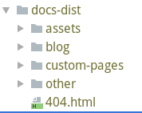

## 关于该主题
- 本博客采用的是Vuepress生成的
- 主题采用的是[meteorlxy](https://github.com/meteorlxy)提供的开源主题[**vuepress-theme-meteorlxy**](https://github.com/meteorlxy/vuepress-theme-meteorlxy)
- 该博客在该主题上做了一些修改
- 若你也对我修改后的主题感兴趣也可以使用我修改后的[主题](https://github.com/zpcwr/vuepress-theme-meteorlxy-cwr)
- 在主题中的APlayer插件是引用于[MoePlayer](https://github.com/MoePlayer)的[APlayer](https://github.com/MoePlayer/APlayer),并对其修改,以适用于本主题
### base路径设置说明
- 当设置base路径时,生成的文件夹里面会有以base名称相同的文件夹,部署时,需将文件夹里的内容剪切至该文件夹的同级目录下

  > 例如:
  >
  > ​	当设置dest(文件生成存放目录)设置为docs-list, base设置为blog时.
  >
  > ​	执行npm run build 会在项目中生成如下文件目录结构
  >
  > ​	
  >
  > ​	其中的blog文件夹就是对应base
  >
  > ​	需将blog文件夹中的内容剪切至docs-list中,并删除blog文件夹

